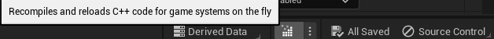

# NBody Simulation - Unreal Engine

This README details the implementation of an NBody simulation system in Unreal Engine, which is further enhanced with gamification features for interactive user engagement. 

The implemented solution is a straightforward, naive approach with O(n^2) complexity. The Barnes-Hut algorithm, which offers an O(nlog⁡n) solution, was considered for its efficiency. However, due to time constraints associated with the task completion, the decision was made to proceed with the simpler, albeit less efficient, naive solution. Future iterations of this project will aim to incorporate the Barnes-Hut algorithm to enhance performance and efficiency.

## Part 1: NBody Simulation

### Overview

The NBody Simulation Manager is designed to simulate gravitational interactions between multiple bodies in a two-dimensional space. It provides a realistic portrayal of how bodies with mass interact under the influence of gravity.

### Features

- **Gravity Simulation**: Accurately models the gravitational forces between bodies.
- **Customizable Parameters**: Allows for the adjustment of simulation parameters including the number of bodies, gravity strength, and body sizes.
- **Efficient Computation**: Optimized to handle a large number of bodies simultaneously.

### Components

- `FBody`: Represents an individual body within the simulation, holding properties such as position, velocity, and mass.
- `FNBodySimulationParams`: A struct containing various parameters to control the simulation.
- `ANBodySimulationManager`: The main actor class responsible for managing and updating the simulation.

### How It Works

1. **Initialization**: At the beginning, the simulation parameters are initialized and the bodies are created.
2. **Simulation Loop**: Each tick updates the positions and velocities of the bodies based on the calculated gravitational forces.

https://youtu.be/LBM3Q3AK3bQ

## Part 2: Gamification Features

### Overview

Gamification elements are introduced to make the simulation interactive and engaging. These features allow users to influence the simulation in real-time.

### Features

- **Interactive Repel Effect**: Users can trigger a repel effect by clicking on the screen, creating an interactive experience.
- **Customizable Gamification Parameters**: Control over gamification features like the strength and duration of the repel effect.

### Components

- `FNBodySimulationGamificationParams`: Contains parameters specific to the gamification aspects.
- Gamification methods within `ANBodySimulationManager`: Methods for handling user interactions and applying gamification effects.

### How It Works

1. **User Interaction**: When a user clicks on the screen, the repel effect is triggered at the clicked location.
2. **Repel Effect**: The repel effect temporarily alters the velocities of nearby bodies, creating a dynamic change in the simulation.

https://youtu.be/5o5UjaQVvcw

## Getting Started

1. **Installation**: Clone the repository and open the project in Unreal Engine 5.1.
2. **Recompile the code**: Recompile and reload de C++ code for game systems.

3. **Configuration**: Adjust the `FNBodySimulationParams` and `FNBodySimulationGamificationParams` to set up the simulation and gamification features.

## Usage

- **Run the Simulation**: Start the simulation to see the gravitational interactions between bodies.
- **Interact**: If gamification is enabled, interact with the simulation using mouse clicks.
